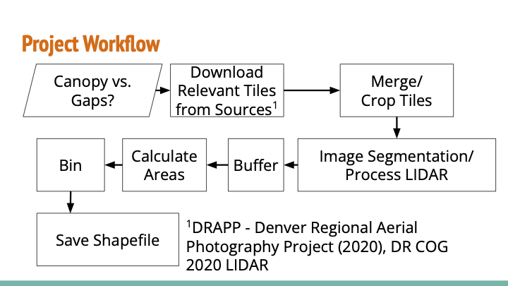
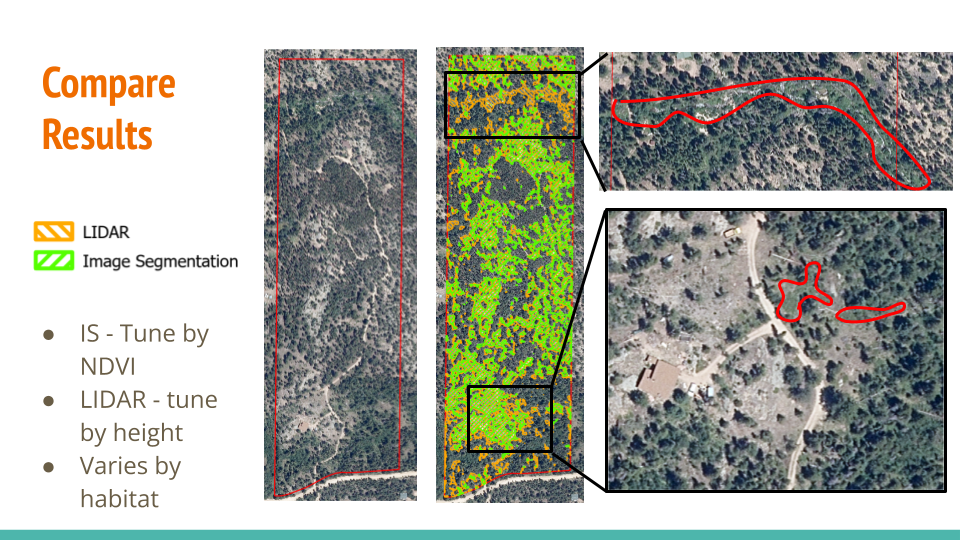

# treebeard

[](https://zenodo.org/doi/10.5281/zenodo.11107001)

Treebeard is a project for identifying canopy gaps/tree gaps for foresters, developed during Earth Data Analytics Professional Graduate Certificate Program at CU Boulder by these students: Ed Chan, Chris Griego, and Peter Kobylarz.

## Project Background
The Watershed Center is interested in identifying canopy gaps and binning them by size (1/8 acre, 1/4 acre, 1/2 acre, and 1+ acre). To quote the forester Eric Frederick:
> Forest structural diversity is a key component of forest ecosystem health, as forests that contain structural heterogeneity are critical for providing wildlife habitat and can be more resilient to natural disturbances. Being able to quantify forest structural heterogeneity is important to be able to assess the need for potential management actions, and it allows us to ensure that our forest management projects are creating structural heterogeneity rather than homogeneity. This tool will allow us to better determine the need for canopy gaps in project areas, and it will allow us to more accurately pinpoint beneficial locations for creating canopy gaps of various sizes when implementing projects.

## Objectives
1. Develop image segmentation method
2. Develop LIDAR processing method
3. Develop QGIS plug-in

## Data Source
- Shape files from the Watershed Center
    - It's already part of the repo at `assets/` which you get from cloning this repository
- [Aerial Data: "Denver Regional Aerial Photography Project (DRAPP)", Denver Regional Counsel of Governance, 2020.](https://data.drcog.org/dataset/denver-regional-aerial-photography-project-tiles-2020) 
- [LIDAR Data: "DRCOG LIDAR QL2 INDEX IN CO SP NORTH 2020", Denver Regional Counsel of Governance.](https://data.drcog.org/dataset/lidar-ql2-index-in-co-sp-north-2020)

Note: Beware the notebooks will download these aerial imagery tiles and LIDAR tiles for you. Please review the download destinations accordingly for your needs.

## Project Workflow



## Results

The results from image segmentation and LIDAR processing yield similar outcomes except the highlighted areas:



## How to Run Jupyter Notebooks
1. Set up the environment (see instructions below)
2. Run `treebeard_image_segmentation.ipynb`
3. Run `treebeard_lidar.ipynb`

## How to Run the QGIS Plug-in
Please refer to the README file at [`qgis_build/treebeard/README.md`](https://github.com/earthlab-education/treebeard/blob/main/qgis_build/treebeard/README.md).

## Setup Instructions

### Set up Environment (First Time)
```
conda activate base
conda install -c conda-forge mamba
mamba env create -f environment.yml
conda activate treebeard
```

### Update Environment
```
conda activate treebeard
mamba env update -f environment.yml
```