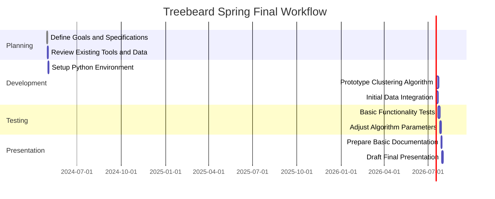

```mermaid
gantt
    dateFormat  YYYY-MM-DD
    title Treebeard Spring Final Workflow

    section Planning
    Define Goals and Specifications   :done,    defs, 2024-04-30, 1d
    Review Existing Tools and Data    :active,  review, after defs, 1d

    section Development
    Setup Python Environment          :active   setup, after review, 2d
    Prototype Clustering Algorithm    :active   proto1, after setup, 5d
    Initial Data Integration          :         dataint, after proto1, 4d

    section Testing
    Basic Functionality Tests         :         test1, after dataint, 3d
    Adjust Algorithm Parameters       :         adjust, after test1, 3d

    section Presentation
    Prepare Basic Documentation       :         doc1, after adjust, 2d
    Draft Final Presentation          :        pres, after doc1, 2d

```