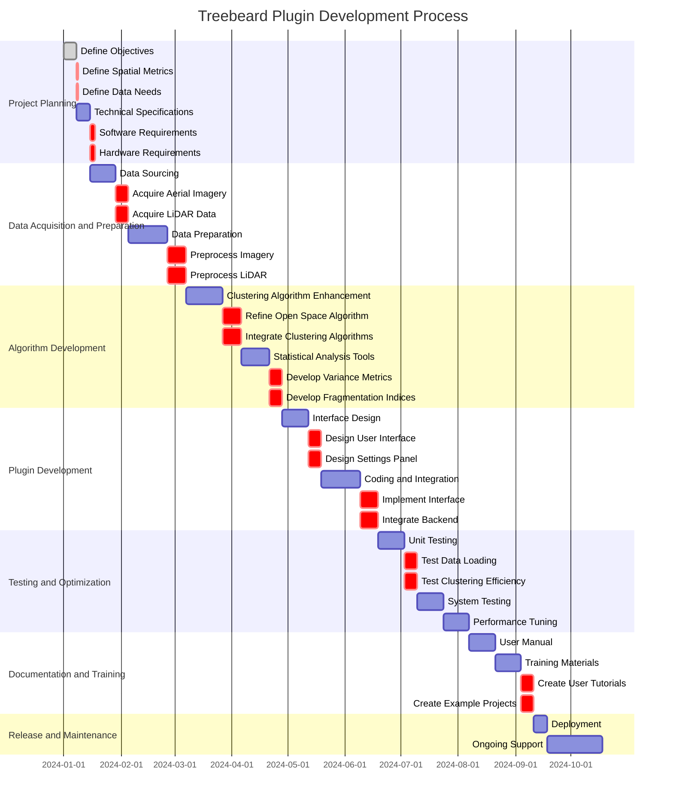

```mermaid
gantt
    dateFormat  YYYY-MM-DD
    title Treebeard Plugin Development Process

    section Project Planning
    Define Objectives             :done,    obj, 2024-01-01, 7d
    Define Spatial Metrics        :crit,    obj1, after obj, 1d
    Define Data Needs             :crit,    obj2, after obj, 1d
    Technical Specifications      :         spec, after obj, 7d
    Software Requirements         :crit,    sr1, after spec, 3d
    Hardware Requirements         :crit,    hr1, after spec, 3d

    section Data Acquisition and Preparation
    Data Sourcing                 :         ds, after spec, 14d
    Acquire Aerial Imagery        :crit,    ai, after ds, 7d
    Acquire LiDAR Data            :crit,    ld, after ds, 7d
    Data Preparation              :         dp, after ai, 21d
    Preprocess Imagery            :crit,    pi, after dp, 10d
    Preprocess LiDAR              :crit,    pl, after dp, 10d

    section Algorithm Development
    Clustering Algorithm Enhancement :      algdev, after pl, 20d
    Refine Open Space Algorithm   :crit,    rosa, after algdev, 10d
    Integrate Clustering Algorithms:crit,    ica, after algdev, 10d
    Statistical Analysis Tools    :         sat, after rosa, 15d
    Develop Variance Metrics      :crit,    dvm, after sat, 7d
    Develop Fragmentation Indices :crit,    dfi, after sat, 7d

    section Plugin Development
    Interface Design              :         id, after dfi, 14d
    Design User Interface         :crit,    dui, after id, 7d
    Design Settings Panel         :crit,    dsp, after id, 7d
    Coding and Integration        :         ci, after dui, 21d
    Implement Interface           :crit,    ii, after ci, 10d
    Integrate Backend             :crit,    ib, after ci, 10d

    section Testing and Optimization
    Unit Testing                  :         ut, after ib, 14d
    Test Data Loading             :crit,    tdl, after ut, 7d
    Test Clustering Efficiency    :crit,    tce, after ut, 7d
    System Testing                :         st, after tdl, 14d
    Performance Tuning            :         pt, after st, 14d

    section Documentation and Training
    User Manual                   :         um, after pt, 14d
    Training Materials            :         tm, after um, 14d
    Create User Tutorials         :crit,    cut, after tm, 7d
    Create Example Projects       :crit,    cep, after tm, 7d

    section Release and Maintenance
    Deployment                    :         dep, after cep, 7d
    Ongoing Support               :         os, after dep, 30d

```